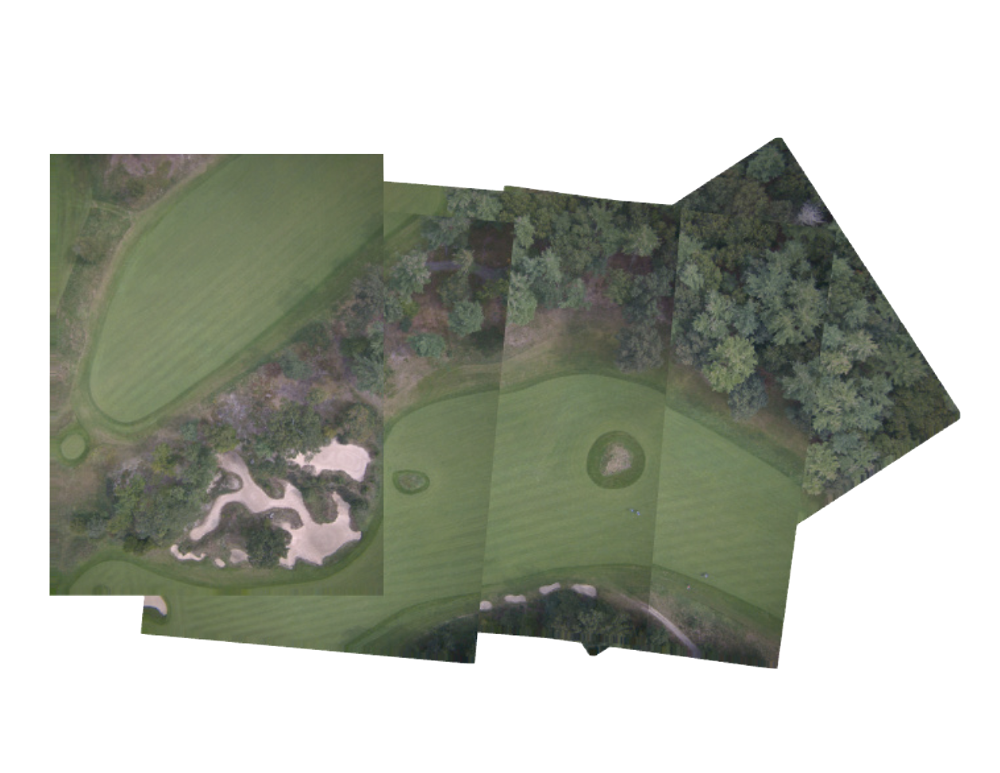

# Pyslamd #
UAV-tailored SLAM stitching inspired by [pySLAM-D](https://github.com/armandok/pySLAM-D). This implementation significantly increases the robustness and usability of the initial design, includes functional documentation, and implements additional matching options and parameters.

<p align="center">

</p>

## Technical explaination ##
The Pyslam-D live stitching algorithm works by generating a factor graph whose nodes are each image’s pose in georeferenced 3D space and whose edges (factors) are the relative pose transformations from one node to another. During the optimization step, the nodes of the factor graph are optimized for spatial consistency, meaning that even noisy factor measurements compound on one another to produce a consistent description of image poses.

The first factor type, odometry factors, are determined by performing visual odometry between neighboring images and using point cloud registration to estimate the pose transformation between the two images. These factors can be computationally expensive, but help neighboring images “mesh” with each other independently of instrument noise. These calculations naturally lend themselves to multithreaded processing.

The second factor type, gps factors, help to determine the image’s position. These factors are often noisy, but are valuable for compensating for bad odometry estimates. Their noise, unlike odometry error, is independent of flight duration, meaning that these factors prevent images from drifting away from their true, georeferenced positions over time.

The third factor type, attitude factors, incorporate attitude measurements from the drone when the picture was taken. These factors make image rotations more accurate and can be used as a prior for the odometry area of overlap, making odometry matching faster and increasing robustness to low overlap and high attitude datasets.

<p align="center">

</p>

## Installation ##
1. Install pyslamd
```bash
git clone https://github.com/kylesayrs/pySLAM-D
python3 -m pip install -e .
```
2. Install [GTSAM](https://gtsam.org)
3. Install [TEASER-plusplus](https://github.com/MIT-SPARK/TEASER-plusplus)

Use cmake .. -DENABLE_DIAGNOSTIC_PRINT=OFF to turn off debug messages for teaser

## Usage ##
Edit `src/pyslamd/Settings.py` to adjust stitching settings. In the future these
settings will be documented as script arguments

```bash
pyslamd.stitch path/to/image/directory
```
Images must be geotagged with gps coordinates in order to georeference frame poses within a real world coordinate frame.
